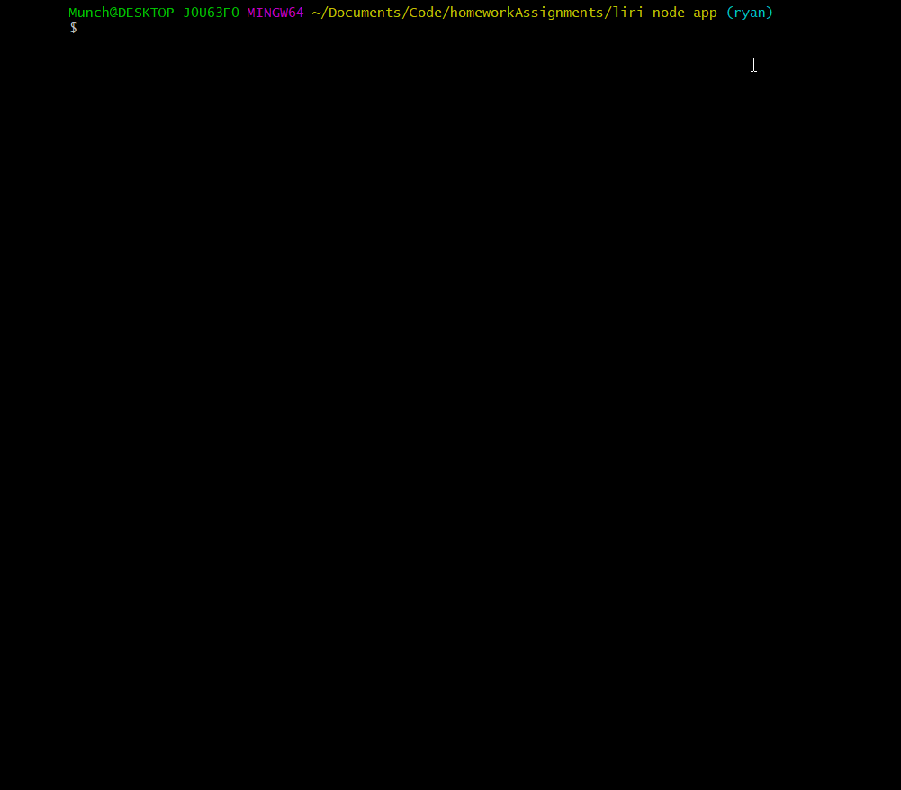
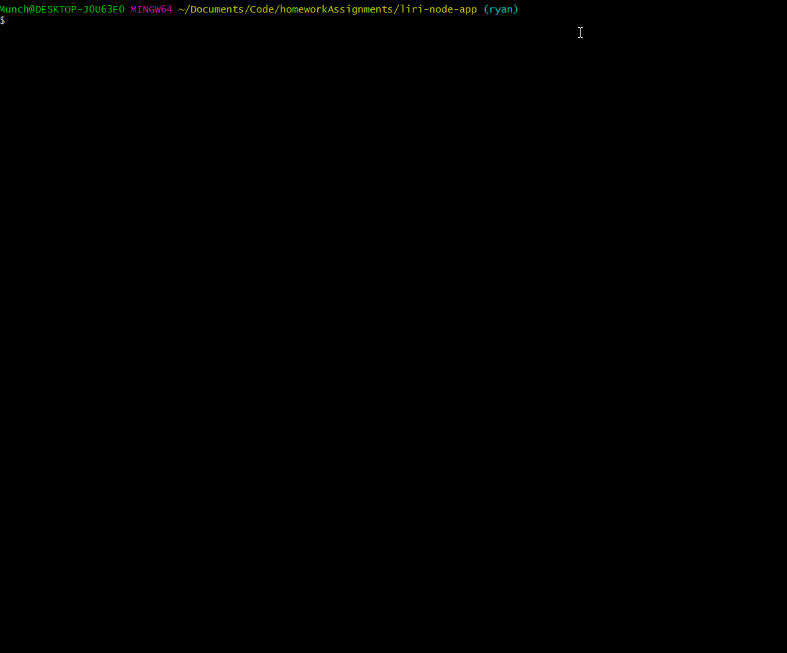

# Liri-Bot App

## What is this app for?
The Liri-Bot App is intended to be a look-up tool for user's wanting information on bands playing upcoming shows in their area, songs they would like to hear, or movie's they want to know more about.

The Liri-Bot App is designed to take a user's input, retrieve the associated data from the requested API, and display a response back to it's user. The three API's being used are the ["Bands-In-Town API"](http://www.artists.bandsintown.com/bandsintown-api), ["Node-Spotify-API"](https://www.npmjs.com/package/node-spotify-api), and ["OMDb API"](http://www.omdbapi.com/).

## How does this app work?
This app will take in a user's input on the command line. Using one of 4 "commands" in the appropriate order, the user can make a query to the above listed API's and retrieve information. The 4 "commands" are: 

    1. concert-this
    2. spotify-this-song
    3. movie-this
    4. do-what-it-says

In order to run these commands, use the following format on your command line:

    node liri.js `insert command here` `desired search`

Let's try to use the "concert-this" command:

As you can see, it will return several show options, each including the name of the venue, the venue location, and the date of the event.

Next let's try the "spotify-this-song" command:

As you can see above, this query will return and display the band name, the song's name, a preview link of the song's video (if available), and the album that song is from. A list of 10 songs associated witht the query will be displayed.

If no input is received it will default undefined and fill in "The Sign" in reference to the band "Ace of Base" as seen below:

Give a high-level overview of how the app is organized
Give start-to-finish instructions on how to run the app
Include screenshots, gifs or videos of the app functioning
Contain a link to a deployed version of the app
Clearly list the technologies used in the app
State your role in the app development

